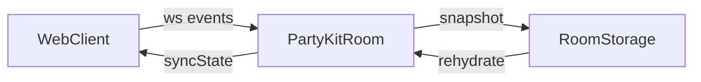

# MVP “Impostor vs Crew” — Plan Ejecutable

## 1) Respuestas a las 3 preguntas bloqueantes
- Skip vote: **sí**, habilitado.
- Expulsión: **mayoría absoluta** (>50% votos válidos). Empate = nadie expulsado.
- Win conditions: **Crew gana** si elimina al impostor. **Impostor gana** si impostor ≥ crew vivos.

## 2) Fase 0 — investigación (timers + balance)

**Defaults propuestos (por voz en Space):**
- Discussion: **120s**
- Voting: **45s**
- Reveal: **20s**

**Rationale (6–10 bullets):**
- En voz, el “hand-off” entre hablar y votar necesita buffer para coordinar.
- 2 minutos de discusión evitan silencios incómodos y permiten defensa mínima.
- 45s de votación mantiene ritmo sin cortar a jugadores móviles.
- Reveal corto (20s) sostiene tensión sin estancar la ronda.
- Timers fijos reducen fricción (menos decisiones del host).
- Votación más corta que discusión limita “meta-debate” fuera de fase.
- La fase de reveal breve reduce el “downtime” y acelera la próxima ronda.
- Defaults alineados a sesiones casuales de 4–8 jugadores.

**Presets de timers:**

| Preset | Discussion | Voting | Reveal | Rationale |
| --- | --- | --- | --- | --- |
| Rápido | 75s | 30s | 12s | Para partidas muy casuales o grupos chicos. |
| Normal | 120s | 45s | 20s | Balanceado para voz y movilidad. |
| Lento | 180s | 60s | 25s | Para grupos grandes o debate intenso. |

**Balance avanzado (apagado por defecto):**
- Recomendación: **2 impostores** para lobbies de **10–20** jugadores.
- Implementar como “preset recomendado” en UI avanzada, pero el default sigue en 1.

## 3) Product Spec

### MVP scope
- Crear sala con **room code** y **password opcional**.
- Unirse con **nickname** (sin cuentas).
- Host inicia ronda, **roles secretos** (1 impostor default).
- Fase discusión con **timer**.
- Fase votación (lista de vivos + skip).
- Reveal con expulsado + “era/no era”.
- Condición de victoria + opción “siguiente ronda / reiniciar”.

### NO-goals
- No mapas, tareas, chat in-app, ni mini-juegos.
- No historial ni persistencia de largo plazo.
- No anti-cheat fuerte (solo honor system).
- No ranking, stats, ni perfiles.

### User stories
**Host**
- Como host, quiero crear una sala con código para compartirla por voz.
- Como host, quiero iniciar y reiniciar rondas en 1 click.
- Como host, quiero expulsar jugadores tóxicos del lobby.

**Jugador**
- Como jugador, quiero entrar rápido con un nickname.
- Como jugador, quiero ver mi rol en secreto una sola vez.
- Como jugador, quiero votar solo si estoy vivo.

### UX principles (mobile-first)
- Botones grandes, 1 acción principal por pantalla.
- Texto claro en español, pocas opciones simultáneas.
- Feedback de estado (fase + timer) siempre visible.
- Evitar scroll largo en pantallas clave.

## 4) Arquitectura + diagrama textual

**Componentes:**
- **Frontend:** Next.js + TypeScript en Vercel.
- **Realtime:** PartyKit rooms (WebSocket + storage por room).
- **Autoridad:** server PartyKit es la fuente de verdad.

**Persistencia / reconexión:**
- Estado serializable en storage por room (snapshot).
- Rehidratación al reconectar usando `clientId` y `reconnectToken`.
- Manejo de “ghost players” por timeout de heartbeat.

**Seguridad / abuso (MVP):**
- Password opcional (hash en server).
- Host puede kick/ban por sesión (in-memory + storage).
- Rate limit de join y nickname (server-side).
- Validación estricta de eventos con zod.

**Diagrama (texto + mermaid):**



## 5) Contratos y tipos

### Tipos base (TypeScript)
```ts
export type PlayerId = string;
export type RoomCode = string;

export type Role = "impostor" | "crew";
export type Phase = "lobby" | "role" | "discussion" | "voting" | "reveal" | "ended";

export type Timers = {
  discussionMs: number;
  votingMs: number;
  revealMs: number;
};

export type Settings = {
  maxPlayers: number; // 4..20
  impostorCount: number; // default 1
  allowSkipVote: boolean;
  majorityRule: "absolute";
  timers: Timers;
  roomPasswordHash?: string;
  autoBalanceImpostors: boolean; // default false
};

export type Player = {
  id: PlayerId;
  nickname: string;
  isHost: boolean;
  isAlive: boolean;
  role?: Role; // solo server y cliente propio
  joinedAt: number;
  lastSeenAt: number;
};

export type Vote = {
  voterId: PlayerId;
  targetId: PlayerId | "skip";
  at: number;
};

export type Round = {
  roundId: string;
  phase: Phase;
  startedAt: number;
  phaseEndsAt?: number;
  votes: Vote[];
  expelledId?: PlayerId;
  wasImpostor?: boolean;
  winner?: "crew" | "impostor" | "none";
  seed: string;
};

export type Room = {
  code: RoomCode;
  createdAt: number;
  settings: Settings;
  players: Player[];
  currentRound?: Round;
};

export type ServerState = {
  room: Room;
  bans: PlayerId[];
  reconnectTokens: Record<PlayerId, string>;
};
```

### Protocolo de eventos

**Client → Server**
- `createRoom` `{ roomCode, password?, settingsOverrides? }`
- `joinRoom` `{ roomCode, nickname, password?, clientId, reconnectToken? }`
- `leaveRoom` `{ clientId }`
- `setNickname` `{ nickname }`
- `startRound` `{}` (solo host)
- `castVote` `{ targetId: PlayerId | "skip" }`
- `endVoting` `{}` (solo host o server por timer)
- `revealResult` `{}` (solo host)
- `restartRound` `{}` (solo host)
- `kickPlayer` `{ playerId }` (solo host)
- `heartbeat` `{ clientId, at }`

**Server → Client**
- `roomCreated` `{ roomCode }`
- `syncState` `{ state: Room, youId: PlayerId, yourRole?: Role }`
- `phaseChanged` `{ phase, endsAt }`
- `voteTally` `{ counts: Record<PlayerId | "skip", number>, expelledId?, wasImpostor? }`
- `playerKicked` `{ playerId }`
- `error` `{ code, message }`
- `pong` `{ at }`

### Reglas de validación (server-side)
- Dead no vota.
- 1 voto por vivo por fase.
- No votar fuera de fase `voting`.
- Solo host puede `startRound`, `endVoting`, `revealResult`, `restartRound`, `kickPlayer`.
- Nickname validado (longitud 2–18, sin espacios extremos, rate limit).

## 6) Blueprint repo + árbol inicial

**Monorepo propuesto:**
```
/apps
  /web
  /party
/packages
  /game
  /shared
/docs
  mvp-impostor-crew-plan.md
```

**Árbol inicial (archivos clave):**
```
apps/web/
  src/app/page.tsx
  src/app/room/[code]/page.tsx
  src/app/components/
    Lobby.tsx
    RoleReveal.tsx
    Discussion.tsx
    Voting.tsx
    Reveal.tsx
    Timer.tsx
  src/lib/partyClient.ts
  src/lib/storage.ts

apps/party/
  src/room.ts
  src/validation.ts
  src/storage.ts

packages/game/
  src/engine.ts
  src/seededRng.ts
  src/index.ts

packages/shared/
  src/types.ts
  src/events.ts
  src/validators.ts
  src/index.ts
```

**Comandos (pnpm):**
- Inicializar monorepo:
  - `pnpm init -y`
  - `pnpm add -w -D pnpm`
  - `pnpm add -w -D typescript`
  - `pnpm add -w -D eslint prettier`
- Inicializar web:
  - `pnpm dlx create-next-app@latest apps/web --ts --app --eslint`
- Inicializar PartyKit:
  - `pnpm dlx create-partykit@latest apps/party`
- Inicializar packages:
  - `mkdir -p packages/game packages/shared`
  - `pnpm add -C packages/game zod`
  - `pnpm add -C packages/shared zod`

**Correr local (2 procesos):**
- PartyKit: `pnpm -C apps/party dev`
- Web: `pnpm -C apps/web dev`

**Env vars necesarias:**
- `NEXT_PUBLIC_PARTYKIT_HOST=http://localhost:1999`
- `PARTYKIT_API_KEY=...` (solo deploy)
- `ROOM_PASSWORD_SALT=...` (server-side)

**Deploy:**
- Web a Vercel: `vercel --prod`
- PartyKit: `pnpm -C apps/party deploy`

## 7) Milestones M0..M5

### M0 — Setup repo y contracts
**Objetivo:** monorepo listo con tipos y validaciones base.
**Tareas (orden):**
1) Crear estructura `apps/` y `packages/`.
2) Crear `packages/shared` con tipos y zod.
3) Exportar contratos desde `packages/shared/src/index.ts`.
**Archivos:**
- `packages/shared/src/types.ts`
- `packages/shared/src/events.ts`
- `packages/shared/src/validators.ts`
- `packages/shared/src/index.ts`
**DoD:** Tipos y zod compilan, exportados, sin UI.
**Riesgos:** duplicación de tipos; mitigación: single source en shared.

### M1 — Game engine puro
**Objetivo:** lógica de juego determinística sin UI.
**Tareas:**
1) Implementar RNG determinístico.
2) Implementar asignación de roles.
3) Implementar transición de fases + tally + win.
**Archivos:**
- `packages/game/src/seededRng.ts`
- `packages/game/src/engine.ts`
- `packages/game/src/index.ts`
**DoD:** funciones puras, sin side effects, con seed.
**Riesgos:** bugs en tally; mitigación: tests unitarios.

### M2 — PartyKit server
**Objetivo:** server autoritativo con validaciones.
**Tareas:**
1) Implementar `room.ts` con eventos.
2) Validación zod en `validation.ts`.
3) Snapshot + rehidratación con storage.
4) Heartbeats y ghost cleanup.
**Archivos:**
- `apps/party/src/room.ts`
- `apps/party/src/validation.ts`
- `apps/party/src/storage.ts`
**DoD:** eventos válidos, reconexión funcional, timers server-side.
**Riesgos:** desync de estado; mitigación: syncState en cada evento.

### M3 — Frontend UI básica
**Objetivo:** pantallas MVP en español, mobile-first.
**Tareas:**
1) Crear lobby y flujo de join.
2) Pantallas Role/Discussion/Voting/Reveal.
3) Integración WS + syncState.
**Archivos:**
- `apps/web/src/app/page.tsx`
- `apps/web/src/app/room/[code]/page.tsx`
- `apps/web/src/app/components/*.tsx`
- `apps/web/src/lib/partyClient.ts`
**DoD:** flujo completo jugable en local.
**Riesgos:** UI no clara; mitigación: textos explícitos y botones grandes.

### M4 — Reglas y UX finales
**Objetivo:** reglas completas + UX polish.
**Tareas:**
1) Validar límites de nickname y rate limit.
2) Implementar kick/ban por sesión.
3) Manejar disconnects y reconexión.
**Archivos:**
- `apps/party/src/room.ts`
- `apps/party/src/validation.ts`
- `apps/web/src/lib/storage.ts`
**DoD:** reconexión estable, abuso mínimo.
**Riesgos:** falsas expulsiones; mitigación: grace period.

### M5 — Tests + Deploy
**Objetivo:** tests mínimos y deploy.
**Tareas:**
1) Tests engine + eventos.
2) Script de simulación N jugadores.
3) Deploy Vercel + PartyKit.
**Archivos:**
- `packages/game/tests/*.test.ts`
- `apps/party/tests/*.test.ts`
- `apps/party/scripts/simulate.ts`
**DoD:** 80% coverage engine, deploys OK.
**Riesgos:** fallas en prod; mitigación: smoke test pre-deploy.

## 8) Plan de tests + coverage
- **Unit tests (game engine):**
  - assignRoles (seeded)
  - transitionPhase
  - tallyVotes (skip + empate + mayoría absoluta)
  - checkWin
- **Event validation tests (server-side):**
  - castVote fuera de fase
  - dead voting
  - host-only actions
- **Simulación N jugadores:**
  - script que conecta N clients con seed fijo y corre 3 rondas.
- **Coverage target:** 80% `packages/game`.

## 9) Checklist final — “Listo para jugar en un Space”
- Crear room en web y compartir code + password por voz.
- Confirmar que 4–20 jugadores pueden unirse.
- Host inicia ronda y todos reciben rol.
- Votación funcional con skip vote.
- Reveal muestra expulsado y rol correcto.
- Win condition resetea a siguiente ronda.
